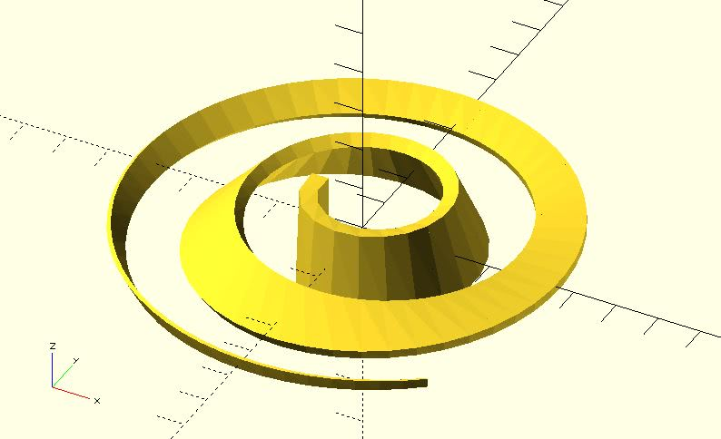

# cross_sections

Given a 2D shape, points and angles along the path, this function will return all cross-sections. Combined with the `polysections` module, you can create a specific path extrusion.

It depends on the `rotate_p` function. Remember to include "rotate_p.scad".

## Parameters

- `shape_pts`: A list of points represent a shape. See the example below.
- `path_pts` : A list of points represent the path.
- `angles` : A list of angles. Each point should have a corresponding angle used to rotate the 2D shape.
- `twist`: The number of degrees of through which the shape is extruded.
- `scale` : Scales the 2D shape by this value over the length of the extrusion. Scale can be a scalar or a vector.

## Examples

	include <rotate_p.scad>;
	include <polysections.scad>;
	include <cross_sections.scad>;
	include <archimedean_spiral.scad>;

	shape_pts = [
		[-2, -10],
		[-2, 10],
		[2, 10],
		[2, -10]
	];

	pts_angles = archimedean_spiral(
		arm_distance = 20,
		init_angle = 180,
		point_distance = 5,
		num_of_points = 100 
	); 

	pts = [for(pt_angle = pts_angles) pt_angle[0]];
	angles = [
		for(i = [0:len(pts_angles) - 1]) [90, 0, pts_angles[i][1]]
	];

	polysections(
		cross_sections(shape_pts, pts, angles, twist = 180, scale = 0.1)
	);

