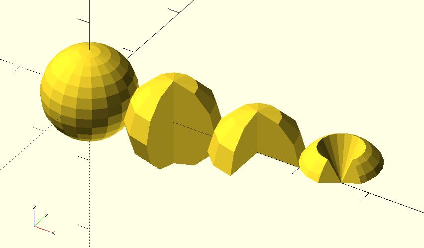

# crystal_ball

Uses spherical coordinate system to create a crystal ball.  

Dependencies: `rotate_p`, `cross_sections`, `polysections`, `ring_extrude`, `shape_pie`.

## Parameters

- `radius` : The radial distance r. 
- `theta` : The azimuthal angle. It defaults to 360. It also accepts a 2 element vector. The first element of the vector is the beginning angle in degrees, and the second element is the ending angle.
- `phi` : The polar angle. It defaults to 180. It also accepts a 2 element vector. The first element of the vector is the beginning angle in degrees, and the second element is the ending angle.
- `$fa`, `$fs`, `$fn` : Check [the circle module](https://en.wikibooks.org/wiki/OpenSCAD_User_Manual/Using_the_2D_Subsystem#circle) or [the sphere module](https://en.wikibooks.org/wiki/OpenSCAD_User_Manual/Primitive_Solids#sphere) for more details. The final fragments will be a multiple of 4 to fit edges.

## Examples

	include <rotate_p.scad>;
	include <cross_sections.scad>;
	include <polysections.scad>;
	include <ring_extrude.scad>;
	include <shape_pie.scad>;
	include <crystal_ball.scad>;
	
	crystal_ball(radius = 6);
	
	translate([12, 0, 0]) 
	    crystal_ball(
	        radius = 6, 
	        theta = 270,
	        $fn = 12
	    );
	
	translate([24, 0, 0]) 
	    crystal_ball(
	        radius = 6, 
	        theta = 270,
	        phi = 90,
	        $fn = 12
	    );    
	    
	translate([36, 0, 0]) 
	    crystal_ball(
	        radius = 6, 
	        theta = [-30, 270],
	        phi = [30, 60]
	    );        

