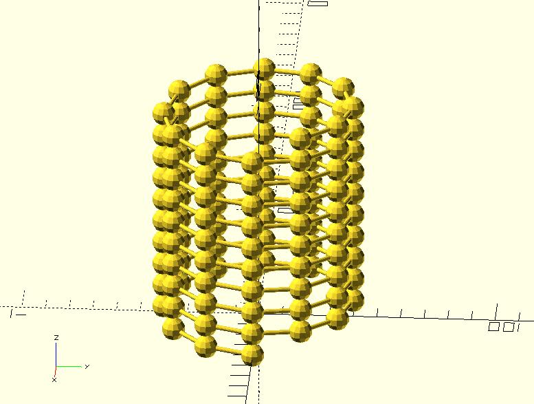
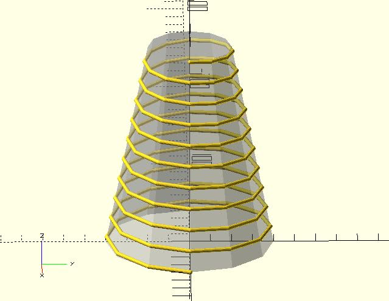

# helix

Gets all points on the path of a spiral around a cylinder. Its `$fa`, `$fs` and `$fn` parameters are consistent with the `cylinder` module. 

## Parameters

- `radius` : The radius of the cylinder. It also accepts a vector `[r1, r2]`. `r1` is the bottom radius and `r2` is the top radius of a cone.
- `levels` : The level count is performed every 360 degrees. 
- `level_dist` : The distance between two vertial points.
- `vt_dir` : `"SPI_DOWN"` for spiraling down. `"SPI_UP"` for spiraling up. The default value is `"SPI_DOWN"`.
- `rt_dir` : `"CT_CLK"` for counterclockwise. `"CLK"` for clockwise. The default value is `"CT_CLK"`.
- `$fa`, `$fs`, `$fn` : Check [the cylinder module](https://en.wikibooks.org/wiki/OpenSCAD_User_Manual/Primitive_Solids#cylinder) for more details.

## Examples
    
	include <helix.scad>;
	include <hull_polyline3d.scad>;
	
	$fn = 12;
	
	points = helix(
	    radius = 40, 
	    levels = 10, 
	    level_dist = 10, 
	    vt_dir = "SPI_UP", 
	    rt_dir = "CLK"
	);
	
	for(p = points) {
	    translate(p) sphere(5);
	}
	
	hull_polyline3d(points, 2);

	include <helix.scad>;
	include <hull_polyline3d.scad>;

	$fn = 12;

	points = helix(
		radius = [40, 20], 
		levels = 10, 
		level_dist = 10, 
		vt_dir = "SPI_UP", 
		rt_dir = "CLK"
	);

	hull_polyline3d(points, 2);

	%cylinder(h = 100, r1 = 40, r2 = 20);

