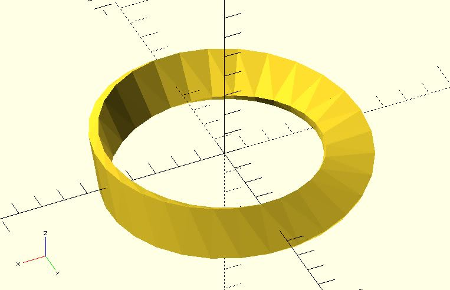
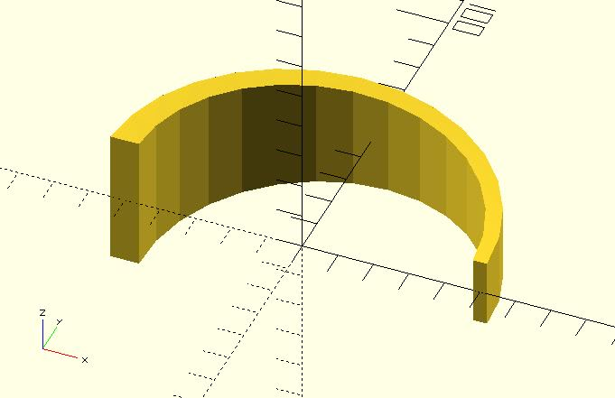

# ring_extrude

Rotational extrusion spins a 2D shape around the Z-axis. It's similar to the built-in `rotate_extrude`; however, it supports `angle`, `twist` and `scale` options. 

Because we cannot retrieve the shape points of built-in 2D modules, it's necessary to provide `shapt_pts` and `triangles`. 

This module depends on `rotate_p`, `cross_section` and `polysections`. Remember to include corresponding ".scad".

If your 2D shape is not solid, indexes of triangles are required. See [polysections](https://openhome.cc/eGossip/OpenSCAD/lib-polysections.html) for details.

## Parameters

- `shape_pts` : A list of points represent a shape. See the example below.
- `radius` : The circle radius.
- `angle` : Defaults to 360. Specifies the number of degrees to sweep, starting at the positive X axis. It also accepts a 2 element vector which defines the central angle. The first element of the vector is the beginning angle in degrees, and the second element is the ending angle.
- `twist` : The number of degrees of through which the shape is extruded.
- `scale` : Scales the 2D shape by this value over the length of the extrusion. Scale can be a scalar or a vector.
- `triangles` : `"SOLID"` (default), `"HOLLOW"` or user-defined indexes. See [polysections](https://openhome.cc/eGossip/OpenSCAD/lib-polysections.html) for details.
- `$fa`, `$fs`, `$fn` : Check [the circle module](https://en.wikibooks.org/wiki/OpenSCAD_User_Manual/Using_the_2D_Subsystem#circle) for more details.

## Examples

	include <rotate_p.scad>;
	include <cross_sections.scad>;
	include <polysections.scad>;
	include <ring_extrude.scad>;

	shape_pts = [
		[2, -10],
		[2, 10],
		[-2, 10],
		[-2, -10]
	];

	ring_extrude(shape_pts, radius = 50, twist = 180);

	include <rotate_p.scad>;
	include <cross_sections.scad>;
	include <polysections.scad>;
	include <ring_extrude.scad>;

	shape_pts = [
		[2, -10],
		[2, 10],
		[-2, 10],
		[-2, -10]
	];

	ring_extrude(shape_pts, radius = 50, angle = 180, scale = 2);

