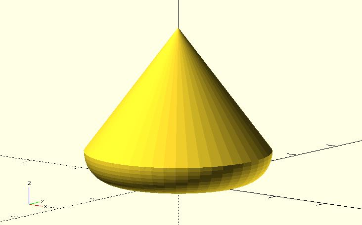

# rounded_extrude

Extrudes a 2D object roundly from 0 to 180 degrees. 

## Parameters

- `size` : The size of a rectangle which can cover the 2D object. Accepts single value, square with both sides this length. It also accepts 2 value array `[x, y]`, rectangle with dimensions `x` and `y`.
- `round_r` : The radius when extruding roundly.
- `angle` : 0 to 180 degrees. The default value is 90 degrees. 
- `convexity`, `twist`: The same as respective parameters of `linear_extrude`.
- `$fa`, `$fs`, `$fn` : Used to control the round fragments. Check [the circle module](https://en.wikibooks.org/wiki/OpenSCAD_User_Manual/Using_the_2D_Subsystem#circle) for more details.

## Examples

	include <rounded_extrude.scad>;

	$fn = 48;

	circle_r = 10;
	round_r = 5;

	rounded_extrude(circle_r * 2, round_r) 
		circle(circle_r);
		
	translate([0, 0, round_r]) 
		cylinder(h = 20, r1 = circle_r + round_r, r2 = 0);

